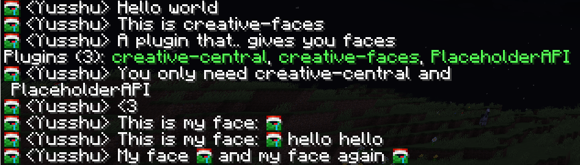

## creative-faces

Welcome to the `creative-faces` documentation, creative-faces is a plugin
to allow Minecraft servers to show the face of a player in the chat. `creative-faces`
uses [creative](https://unnamed.team/docs/creative), *the library for resource-packs*, and
[creative-central](https://unnamed.team/docs/creative-central), *the plugin that unifies resource-packs*

`creative-faces` supports multiple placeholder systems like [MiniPlaceholders](https://github.com/MiniPlaceholders/MiniPlaceholders)
and [PlaceholderAPI](https://github.com/PlaceholderAPI/PlaceholderAPI)

### Features
- Add faces to the chat, signs, anvils, items, guis, everywhere!
- Uses `creative-central` so you have all its features:
- - Automatically generates the server's resource-pack
- - Automatically upload the resource-pack to a server or host it locally
- - Automatically send the resource-pack to everyone
- Easy to use
- - If you use PlaceholderAPI, just use `%faces_face%` to show the player's head
- - If you use MiniPlaceholders, just use `<faces_face>`
- Developers API