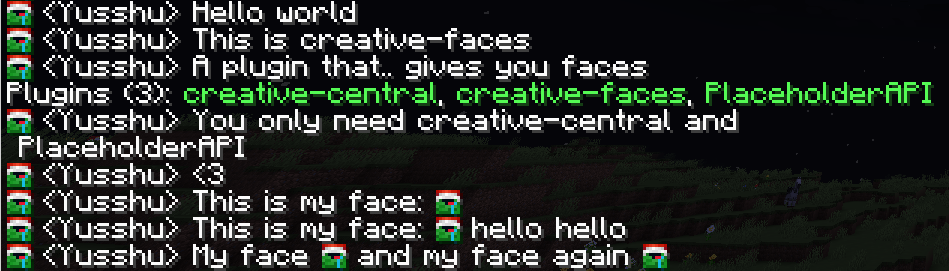

# creative-faces

A plugin for Minecraft servers to show player faces in the chat, signs, scoreboards, tab, etc.
`creative-faces` uses [creative](https://github.com/unnamed/creative), *the library for resource-packs*,
[creative-central](https://github.com/unnamed/creative), *the plugin that unifies
resource-packs*, and a placeholder system like [MiniPlaceholders](https://github.com/MiniPlaceholders/MiniPlaceholders)
or [PlaceholderAPI](https://github.com/PlaceholderAPI/PlaceholderAPI)

